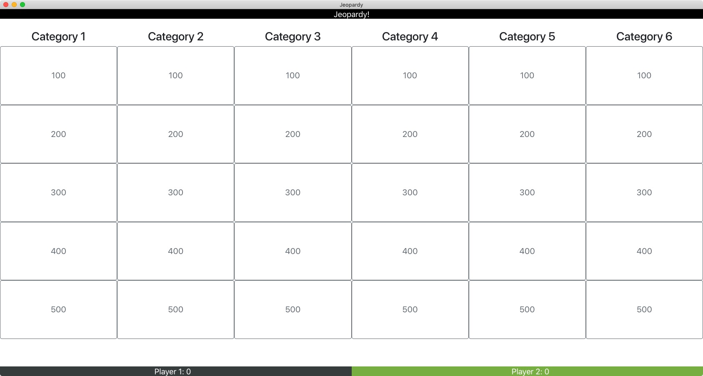

# jeopardy



This is a hacky piece of software to play the Jeopardy! gameshow. It's written in Python and JavaScript using the [Eel library by Chris Knott](https://github.com/ChrisKnott/Eel). Please keep in mind that this project is in no way affiliated with Jeopardy! or its producers.

## Usage

### Installation

The ```main.html``` file in the ```web/``` directory expects a ```bootstrap.css``` to be present for correct rendering, so retrieving that is part of the installation process.

```
git clone https://github.com/nkreer/jeopardy
cd jeopardy
pip3 install eel
wget https://stackpath.bootstrapcdn.com/bootstrap/4.1.2/css/bootstrap.min.css -O web/bootstrap.css
```

### Playing

To play, you need to supply a json file with the clues. 