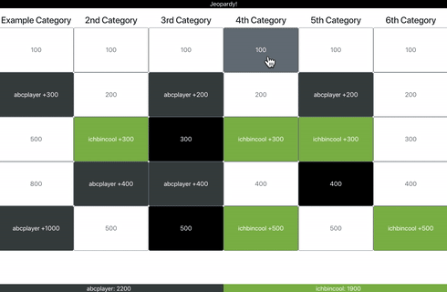

# jeopardy



This is a hacky piece of software to play the Jeopardy! gameshow. It's written in Python and JavaScript using the [Eel library by Chris Knott](https://github.com/ChrisKnott/Eel). Please keep in mind that this project is in no way affiliated with Jeopardy! or its producers. All code of this project is released under the [MIT License](LICENSE).

## Usage

### Installation

The ```main.html``` file in the ```web/``` directory expects a ```bootstrap.css``` to be present for correct rendering, so retrieving that is part of the installation process.

```
git clone https://github.com/nkreer/jeopardy
cd jeopardy
pip3 install eel
wget https://stackpath.bootstrapcdn.com/bootstrap/4.1.2/css/bootstrap.min.css -O web/bootstrap.css
```

### Playing

#### Creating cluesets/Preparation

To play, you need to supply a json file containing the clues. You can use ```clues/example.json``` as a starting point. The file defines a list of categories, each category containing a name and a set of clues. If you want, you can also specify the value of the clues for each category independently.

Schema:

```json
[
    {
        "name": "Category name",
        "clues": [
            {
                "clue": "Your clue here",
                "response": "(optional) The expected response",
                "double": "set to true if it should be a double jeopardy"
            }
        ]
    }
]
```

#### Running

Run ```python3 app.py path/to/clues.json``` in order to start the game with the supplied clues. It'll ask you for the names of the players and allows you to supply a specific color or key for the player if you don't want to use the default. There are default values for up to six players. When you're finished, simply leave the input for a new player name blank and the board will open in a Chromium/Chrome window.

#### Managing the game

Click on a button to play a clue. Players can buzz in using the key specified during setup. You can use the following keys to then manage the game:

While the board is displayed:

```
w - export the game data so it can be loaded later
r - re-load the board
x - randomly select a player (result is shown in the infobar)
```

While showing a clue:

```
q - return to the board, discard
w - return to the board, mark the clue as played
r - reset buzzed in player
v - verify the response of the buzzed in player as correct, give points
x - incorrect response, take points
c - reveal the expected response (on the host display only)
```

These are customisable in ```config.json```.

Thanks to some Eel magic, you have the option to enable a host screen. This will let you view the expected response provided with the clues. To activate this feature, set ```host_screen``` in ```config.json``` to true. Please note that enabling this will open up a seperate **viewer**-window! The regular host window must be in focus in order to capture the keys pressed.